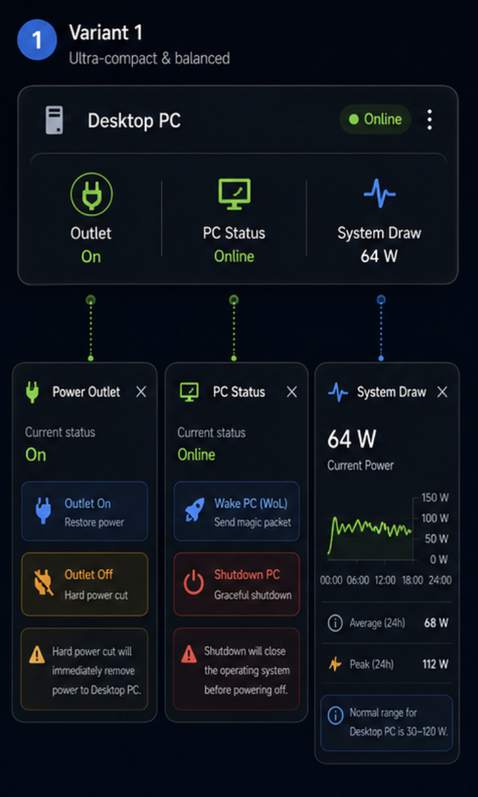
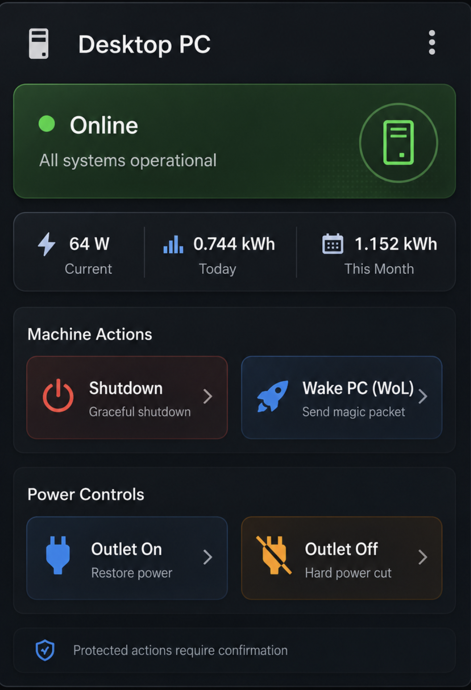

# Computer Control Card

A frontend-only Home Assistant Lovelace custom card for monitoring and controlling a desktop PC, server, or other computer from your dashboard. The card is designed around quick status visibility, safe power actions, and a compact/extended layout choice for different dashboard densities.

## Project overview

`computer-control-card` provides a `custom:computer-control-card` Lovelace card that can:

- Show a computer name, status, outlet state, and power/energy metrics from a configured Home Assistant entity.
- Render either a compact card for dense dashboards or an extended card for a larger control panel.
- Call Home Assistant services for actions such as Wake-on-LAN, shutdown, restart, and outlet power control.
- Require confirmation before protected actions such as shutdown, restart, or hard power-off.

The card is a Home Assistant frontend resource built with Lit and Vite. It does not create Home Assistant entities by itself; provide the sensors, switches, buttons, scripts, or Wake-on-LAN services that match your setup.

## HACS installation and readiness notes

This repository includes the files HACS expects for a custom Lovelace card:

- `hacs.json` declares the distributed filename as `computer-control-card.js`.
- The package build output is configured for `dist/computer-control-card.js`.
- The README is renderable by HACS.

Until this repository is available as a default HACS repository, add it as a custom repository:

1. In Home Assistant, open **HACS**.
2. Go to **⋮ > Custom repositories**.
3. Add this repository URL.
4. Select **Dashboard** (or **Lovelace** in older HACS versions) as the category.
5. Install **Computer Control Card**.
6. Clear your browser cache or reload Home Assistant after updating the card.

After installation, HACS normally adds the frontend resource automatically. If you install manually, add the built resource yourself:

```yaml
url: /hacsfiles/computer-control-card/computer-control-card.js
type: module
```

For local/manual development builds, run:

```bash
npm install
npm run build
```

Then copy `dist/computer-control-card.js` to the Home Assistant `www` or HACS-managed custom card location you use.

## Lovelace usage

Add the card to a Lovelace dashboard with YAML mode or the manual card editor:

```yaml
type: custom:computer-control-card
entity: sensor.desktop_pc_status
name: Desktop PC
variant: compact
```

The configured `entity` is used for display state and metric attributes. Action buttons call the services configured under `actions`. If no custom actions are supplied, the card includes basic Wake, Shutdown, and Restart button-style defaults.

### Entity attributes used by the card

The card reads these optional attributes from the configured entity when present:

- `outlet_status`, `outlet`, or `power_outlet` for outlet state.
- `power`, `system_draw`, or `draw_w` for current system draw.
- `today_kwh` or `energy_today` for daily energy.
- `month_kwh` or `energy_month` for monthly energy.
- `trend` or `power_trend` for compact system-draw detail text.

## Configuration examples

### Compact variant

Use the compact variant when you want a small overview card with expandable controls for outlet, PC status, and system draw.

```yaml
type: custom:computer-control-card
title: Computer
entity: sensor.desktop_pc_status
name: Desktop PC
variant: compact
actions:
  - label: Wake PC
    icon: mdi:rocket-launch
    domain: button
    service: press
    service_data:
      entity_id: button.desktop_pc_wake
  - label: Shutdown PC
    icon: mdi:power-off
    domain: button
    service: press
    service_data:
      entity_id: button.desktop_pc_shutdown
    confirmation: Shut down Desktop PC?
  - label: Outlet On
    icon: mdi:power-plug
    domain: switch
    service: turn_on
    service_data:
      entity_id: switch.desktop_pc_outlet
  - label: Outlet Off
    icon: mdi:power-plug-off
    domain: switch
    service: turn_off
    service_data:
      entity_id: switch.desktop_pc_outlet
    confirmation: Hard power off Desktop PC?
```

### Extended variant

Use the extended variant for a larger dashboard tile that keeps machine actions and power controls visible without opening compact panels.

```yaml
type: custom:computer-control-card
title: Desktop Controls
entity: sensor.desktop_pc_status
name: Desktop PC
variant: extended
actions:
  - label: Shutdown
    icon: mdi:power-off
    domain: script
    service: turn_on
    service_data:
      entity_id: script.desktop_pc_graceful_shutdown
    confirmation: Gracefully shut down Desktop PC?
  - label: Wake PC
    icon: mdi:rocket-launch
    domain: button
    service: press
    service_data:
      entity_id: button.desktop_pc_wake
  - label: Outlet On
    icon: mdi:power-plug
    domain: switch
    service: turn_on
    service_data:
      entity_id: switch.desktop_pc_outlet
  - label: Outlet Off
    icon: mdi:power-plug-off
    domain: switch
    service: turn_off
    service_data:
      entity_id: switch.desktop_pc_outlet
    confirmation: This immediately removes power from Desktop PC. Continue?
```

Action calls include the configured top-level `entity` as `entity_id` by default. When an action controls a different entity, provide that target in `service_data.entity_id` as shown above. For services that do not accept `entity_id`, route the operation through a Home Assistant script or button helper and point the card action at that entity instead.

## Screenshots and design references

The images below are design references, not exact render output from the current implementation. They document the intended visual direction and interaction model for the compact and extended layouts.



**Compact mockup:** a dense overview layout with three tappable status zones and contextual popover panels for outlet controls, machine controls, and power draw details.



**Extended mockup:** a full-height control surface with an online status banner, energy metrics, visible shutdown/wake actions, visible outlet controls, and a confirmation reminder.

## Development

```bash
npm install
npm run build
npm run typecheck
npm test
```

For the local demo app:

```bash
npm run demo
```
